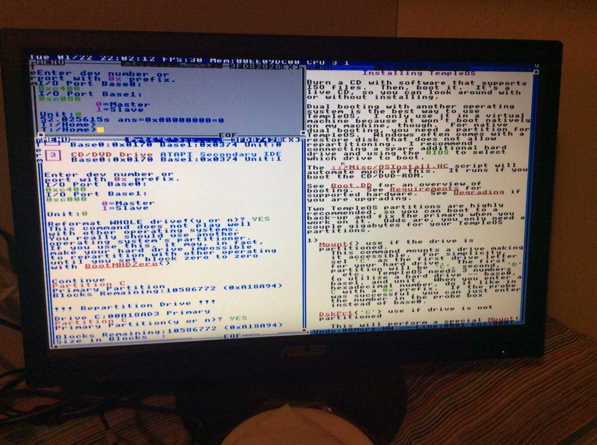

# Installing TempleOS on baremetal on machines without a CD/DVD drive and dual-booting with linux

so I wanted to get TempleOS running on bare metal, specifically on my
thinkpad x200 and alongside my linux install.

the first hurdle to overcome is that I don't have an actual cd/dvd drive
on the thinkpad (no docking station yet) so I put together a temporary pc
with old 775 era parts (msi g41m-p33 combo + intel q9650) and found an
old ide dvd burner that I used to burn the iso to a dvd

another thing to note is that you must use PS2 mouse and keyboard, usb
is not supported

this was enough to boot from dvd on the temporary machine.

the next step is to see if i can get it to install on a hdd or ssd. you
need to figure out your sata or ide controller's i/o ports so I booted a
void linux xfce live iso and did a lspci -v. if you scroll through you
eventually find something like this:

```
00:1f.2 SATA controller: Intel Corporation 9 Series Chipset Family SATA Controller [AHCI Mode] (prog-if 01 [AHCI 1.0])
        Subsystem: Gigabyte Technology Co., Ltd Device b005
        Flags: bus master, 66MHz, medium devsel, latency 0, IRQ 27
        I/O ports at f090 [size=8]
        I/O ports at f080 [size=4]
        I/O ports at f070 [size=8]
        I/O ports at f060 [size=4]
        I/O ports at f020 [size=32]
        Memory at f7f35000 (32-bit, non-prefetchable) [size=2K]
        Capabilities: [80] MSI: Enable+ Count=1/1 Maskable- 64bit-
        Capabilities: [70] Power Management version 3
        Capabilities: [a8] SATA HBA v1.0
        Kernel driver in use: ahci
        Kernel modules: ahci
```

note that this output is from my main pc, the output from the actual 775
build i booted TempleOS on was this: 

if you have ide you will also see another entry for the ide controller.
write down the i/o ports for your controller (if you use a sata hdd you
would write down the ones for the sata controller, and vice versa)

at this point I booted back into TempleOS and tried to install to disk.
at the I/O port prompt I instead opened a separate terminal with
CTRL+ALT+T and did ```Mount;``` so i could attempt different I/O ports
until it worked.

the ports that I found to be working for me were the ones with size=8,
specifically 0xc400 as the first one and 0xc000 as the second one
(see the photo of my lspci above)

my disk had two fat32 partitions ready to go alongside a linux install
but TempleOS didn't seem to see them. it only listed the main linux root
and swap partitions as UNKNOWN. so I tried again with a completely
blank unpartitioned hard disk and did a whole disk install and it worked.
if the disk is unpartitioned it should prompt you automatically to
partition, but if it doesn't, just open a new window with CTRL+ALT+T and
run ```DskPrt;```




because TempleOS has, in Terry's words, "half-assed FAT32 support", the
ideal setup is using redsea filesystem for your main partition and then
make a second FAT32 partition with a back-up install that you mainly use
to mirror your redsea install over when you want to mount it from linux
or other OSes and transfer files out of TempleOS. just don't do work or
move around and rename files on the FAT32 partition because it's likely
to get corrupted

after rebooting I was able to boot TempleOS from disk just fine.


this is great, but i want to run TempleOS in dual boot with linux on my
thinkpad, so how can I get it to install on a pre-partitioned drive?
I found that having a partition scheme at all, at least for linux-created
partition schemes, makes even the ```DskPrt;``` fail.

I also tested a SSD that had Windows 7 installed on it, and in this case
TempleOS happily detected overwrote the NTFS partition and even preserved
Windows' bootloader correctly, so it would have probably dual-booted with
windows if I had a separate FAT partition ready.
I used FAT32 in this case so I could later easily mount the install and
analyse it from linux

it seems to be REALLY picky with partition schemes created from linux for
some reason - if I create fat partitions it doesn't see them but if I
mark them as Linux type partitions it sees them as UNKNOWN and can't
seem to format them or repartition at all

out of curiosity I tried to hook up the SSD to my laptop and see if it
would boot the TempleOS install and while the bootloader works, as soon
as I try to boot it panics because DskChg fails. I suspect that when the
kernel is compiled and installed, the I/O ports are hardcoded somewhere in
the binary and I need to changes them

before I even try to install it alongside linux I have to figure out how
to make the install work on a different machine

[Boot.DD](https://templeos.holyc.xyz/Wb/Doc/Boot.html) describes the boot
process, but from the error I get I know we're at least hitting KMain in
the Kernel binary. it prints the os version, "Enable IRQ's" and then
throws on ```DskChg(':')```, and it seems like DrvChk is failing
specifically


turns out that by simply running ```BootHDIns('D');``` (or whatever drive
letter you installed on) you recompile and reinstall the kernel. it
prompts you to mount disks, and at this point you're able to customize
the I/O ports. I mount D with the thinkpad's I/O ports, then press enter
at the next drive prompt to finish the mounting step, and just skip
through the next few options.

I reboot and as expected it doesn't boot anymore. but if I move it to the
thinkpad... bam! after trying a few I/O port combinations by doing
BootHDIns from the install CD it boots! in the thinkpad's case it was
still the two size=8 ports but in the opposite order as the ones I had
for the pc

now comes the hard part, getting it to install alongside linux

I tried marking the partition for TOS as linux so the installer would
see it, but the it just fails to write to it at all when it tries to
format it. this does mark the partition as fat32 or redsea though and i can
verify that by plugging it back into my pc. what if I now format it to
fat32 properly and try to install again? nope, it still doesn't see it

looks like the MBR id for redsea is 0x88, what if i set the partitions to
that? also what about ntfs, since it managed to overwrite my win7 ntfs
partition easily? nope still nothing

after running gdisk -l on my ssd i see that it detects an invalid GPT and
a valid MBR. could it be that when i repartitioned i didn't completely
wipe the old GPT partitioning scheme?

I used the 'z' command in gdisk to zap GPT and keep MBR:

```
$ sudo gdisk /dev/disk/by-id/ata-KINGSTON_XXXXXXXXXXXX_XXXXXXXXXXXXXXXX
[sudo] password for loli: 
GPT fdisk (gdisk) version 0.8.10

Partition table scan:
  MBR: MBR only
  BSD: not present
  APM: not present
  GPT: not present


***************************************************************
Found invalid GPT and valid MBR; converting MBR to GPT format
in memory. THIS OPERATION IS POTENTIALLY DESTRUCTIVE! Exit by
typing 'q' if you don't want to convert your MBR partitions
to GPT format!
***************************************************************


Warning! Secondary partition table overlaps the last partition by
33 blocks!
You will need to delete this partition or resize it in another utility.

Command (? for help): x

Expert command (? for help): z
About to wipe out GPT on /dev/disk/by-id/ata-KINGSTON_XXXXXXXXXXXX_XXXXXXXXXXXXXXXX. Proceed? (Y/N): Y
GPT data structures destroyed! You may now partition the disk using fdisk or
other utilities.
Blank out MBR? (Y/N): n
MBR is unchanged. You may need to delete an EFI GPT (0xEE) partition
with fdisk or another tool.
```

I also set my partition to type 0x88 with cfdisk just to make sure it's
visible to TOS

... still nothing!

I'm gonna try to wipe the MBR, create the partition scheme from TempleOS
WITHOUT formatting and making sure to use the same exact block count
as my original partitions. if anything goes bad I have a full back up of
the SSD I can restore as many times as I want

wiping the partition table:

```
sudo sgdisk --zap-all /dev/disk/by-id/ata-KINGSTON_XXXXXXXXXXXX_XXXXXXXXXXXXXXXX
```

interestingly, TempleOS only sees 15872157 available blocks, which is
around 8GB. could it be that due to some limitation it can only work with
the first 8 gigs of the disk? so maybe I could move the linux partition
8 gigs forward and install TempleOS in the first 8 gigs!

so what I'm gonna do is:
* partition from TempleOS from scratch, make 2 partitions for the main
  redsea install and the secondary FAT partition
* create my linux partitions right after TempleOS with the exact same
  block counts as before and restore them from my backup
* reinstall grub from linux, then install TempleOS' bootloader
  over it so it properly backs up the old MBR and I'll be able to boot
  linux from the TempleOS bootloader

to reinstall grub i simply chrooted into the linux partition:

```
sudo mount /dev/disk/by-id/ata-KINGSTON_XXXXXXXXXXXX_XXXXXXXXXXXXXXXX-part3 /mnt/parabola
sudo mount -o bind /dev /mnt/parabola/dev
sudo mount -t devpts /dev/pts /mnt/parabola/dev/pts
sudo mount -t proc proc /mnt/parabola/proc
sudo mount -t sysfs sys /mnt/parabola/sys
sudo chroot /mnt/parabola
bash
grub-install --target=i386-pc /dev/disk/by-id/ata-KINGSTON_XXXXXXXXXXXX_XXXXXXXXXXXXXXXX
grub-mkconfig -o /boot/grub/grub.config
exit
exit
sudo umount -lf /mnt/parabola/{dev{/pts,},proc,sys,}
```

then I edited /etc/fstab, it used to be sda1 root and sda2 swap but now
that we have 2 extra parts at the beginning it's sda3 and sda4

I then verified that linux boots and it does boot fine

now I install TempleOS and its bootloader and ... holy shit, it actually
boots! success!

and if I choose "old boot record" it will boot into grub as before,
perfect!

one gotcha: make sure you only install the TempleOS bootloader once and
copy over the /0000Boot/OldMBR.BIN.C to your secondary FAT partition if
you made one, that way you wont have to pick the old mbr twice at boot
to get into grub

if in doubt, you can do ```Dump("C:/0000Boot/OldMBR.C.BIN");``` and
```Dump("D:/0000Boot/OldMBR.C.BIN");``` and see which one has grub related
text in it, and keep the one that does

```BootMHDIns('C');``` is what actually overwrites an backs up the MBR,
so if you accidentally overwrite templeOS' mbr you can always reinstall it
by running this command from the live dvd without wiping your install

and here's [a video of the thinkpad booting TempleOS and Linux](https://streamable.com/bj6qy)

I know the TempleOS version I'm running is not the latest, I have hundreds
of ISO's from the archive and didn't manage to pick the newest one in
a hurry. I will copy over the latest 5.03 files and all the supplementals,
it's easy once you got everything installed, just copy the new files from
linux to FAT, then from FAT to redsea and recompile the kernel

# Installing supplementals
instad of burning each ISO's to new disks we can just mount them from
linux and copy the files to the FAT partition. there's a fuse
implementation of the red sea file system that should be enough to get
files off the iso

boot into linux and install fuse, python2.7 and pip for python2.7. on
arch linux, the packages would be ```pacman -S fuse python2 python2-pip```

now install obecebo's fuse driver for redsea

```
wget https://raw.githubusercontent.com/obecebo/redseafs/master/isoc.py
wget https://raw.githubusercontent.com/obecebo/redseafs/master/isoc-mount
```

edit both files and change the first line from

```
#!/usr/bin/env python
```

to

```
#!/usr/bin/env python2.7
```

as the code is python2 specific

```
chmod +x isoc-mount
sudo mv isoc-mount /usr/bin/
sudo mv isoc.py /usr/bin/
```

now we can mount ISO's like so

```
isoc-mount TOS_Distro.ISO ~/iso
```

now you can copy everything from ~/iso to your TempleOS FAT partition,
but ** be careful not to overwrite any .BIN.C files ** as this would
break your install if you don't know what you're doing

to be fair, it's fine if you break your FAT install as long as you don't
copy the BIN files to the redsea partition, because you'd still be able
to boot into the redsea partition, copy the new files, recompile the kernel
and install it on both partitions. but it's better to be safe than sorry.
if your TempleOS install becomes unusable and you don't have any back-ups
you'll need to boot from CD/DVD to repair it

this a script I wrote to rsync an iso to the fat partition while excluding
BIN.C files:

```
#!/bin/sh

mntpnt="${TOS_MOUNTPOINT:-/mnt/tos}"
isofile="$1"
param2="$2"
grep RedSea < /etc/mtab && fusermount -u ~/iso
echo "waiting for umount..."
while grep RedSea < /etc/mtab; do
  sleep 0.2
done
isoc-mount "$isofile" ~/iso || exit
echo "waiting for mount to come up..."
while ! grep RedSea < /etc/mtab; do
  sleep 0.2
done
shift
case "$param2" in
 --*) destdir="$mntpnt" ;;
 *)
  destdir="$mntpnt/$param2"
  shift
  ;;
esac
mkdir -p "$destdir"
rsync ~/iso/ "$@" --exclude='*.BIN.C' -rvu "$destdir" &&
echo "BIN.C files that were NOT copied:" &&
find ~/iso -name '*.BIN.C'
fusermount -u ~/iso
```

adjust to your TempleOS mount-point, save as tos-mirror and run

```
chmod +x tos-mirror
tos-mirror TOS_Distro.ISO
```

this script supports more advanced options, such as

mirroring to a specific directory

```
tos-mirror TOS_Supplemental1.ISO Home/Sup1
```

checking what files would be copied without actually copying them

```
tos-mirror TOS_Web.ISO --dry-run
```

after you're done copying everything you can boot into TempleOS and do a

```
CopyTree("D:/","C:/");
```

then recompile the kernel

```
BootHDIns('C');
```

as a safety measure, you could instead boot into D (the FAT partition),
recompile the kernel from there, reboot, see if it boots and then
copy it over to redsea
